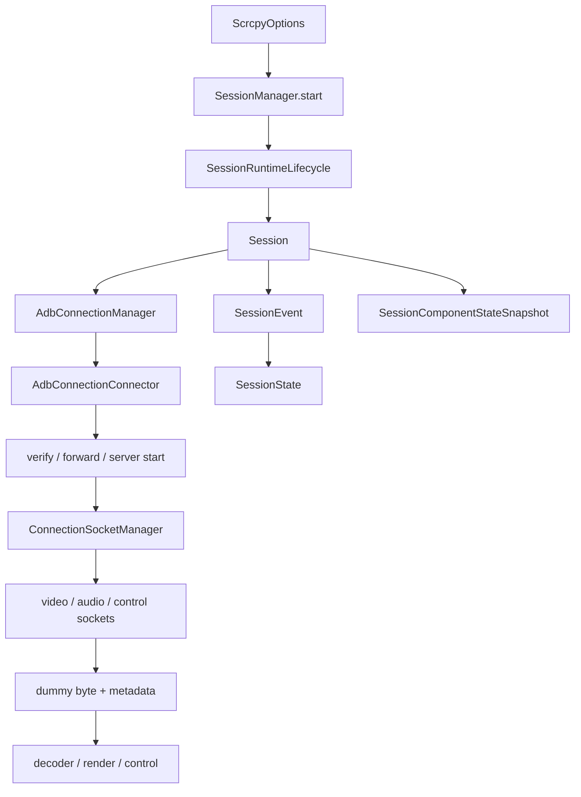

# 运行时主链路

相关文档：

- [架构原则](principles.md)
- [会话状态与事件](session-state.md)
- [事件系统与 Shell 接入](../03-guides/event-and-shell.md)
- [排障方法](../04-analysis/troubleshooting.md)
- [USB 与 Wireless Debugging 当前状态](../05-handoff/usb-and-wireless.md)

## 运行时结构图

## 运行时模型

可以把当前项目的运行时理解为一条从配置到执行的链路。

主线如下：

1. 读取或创建会话配置
2. 激活当前会话
3. 建立 ADB 连接
4. 执行连接验证
5. 建立端口转发
6. 推送并启动 server
7. 建立视频、音频、控制链路
8. 读取 metadata
9. 启动解码和渲染
10. 处理控制输入
11. 结束会话或触发重连

## 关键类与职责

| 类 / 对象 | 主要职责 | 关键点 |
|---|---|---|
| `ScrcpyOptions` | 唯一配置载体 | 同时承载用户配置和设备能力 |
| `SessionManager` | 活跃会话入口 | 当前只维护一个运行中的会话 |
| `Session` | 单个运行中会话 | 持有状态流、资源引用、事件入口 |
| `AdbConnectionManager` | ADB 统一门面 | 装配建链、连接池、互斥控制和 USB detach |
| `AdbConnectionConnector` | 真正执行建链 | 区分 TCP/TLS/USB 路径 |
| `ConnectionSocketManager` | socket 建立与关闭 | 负责 video/audio/control 建链与 dummy byte |
| `SocketForwarder` | 本地端口到设备 socket 转发 | 处理 accept、open、双向转发和关闭 |
| `ScrcpyEventBus` | 会话级事件总线 | 更适合观测和调试，不应承担唯一业务真相 |

## 配置态

配置态的核心是 `ScrcpyOptions`。

它承载两类信息：

- 用户配置
- 设备能力

用户配置决定期望行为。
设备能力决定实际可用边界。

最终运行结果取决于这两类信息的合成。

在实现上，`ScrcpyOptions` 通过 `copy()` 完成按字段更新，因此 UI 和连接检测都不需要直接改动共享可变对象。

## 会话存储

会话存储负责把配置持久化下来，让用户不需要每次重新配置。

它应负责：

- 保存
- 读取
- 枚举会话

它不应直接承担运行时状态机职责。

当前运行中会话由 `SessionManager.start(options, storage, onVideoResolution)` 创建，并由 `SessionRuntimeLifecycle` 托管切换和停止。

## 活跃会话管理

当前系统通常只维护一个活跃会话。

活跃会话管理的重点不只是“记住当前是哪台设备”，而是：

- 当前运行态归属于谁
- 当前资源归属于谁
- 当前异常和日志归属于谁

如果这层归属关系不清楚，就会出现跨会话串状态的问题。

`Session` 当前承载的核心成员包括：

- `_options`
- `storage`
- `runtime`
- `resources`
- `adbConnection`
- `codecInfo`
- `monitorBus`
- `sessionState: StateFlow<SessionState>`
- `componentSnapshot: StateFlow<SessionComponentStateSnapshot>`

## 连接链路

一次成功的远控流程，连接链路至少要回答以下问题：

### ADB 是否健康

这是进入主链路的第一道门槛。

### forward 是否建立

如果转发没建立，后续 server 和 socket 逻辑都不成立。

### server 是否真正启动

不是命令发出就算成功，而是要确认服务端已经进入可通信状态。

### socket 是否完整连接

通常至少要关心：

- video
- audio
- control

只连上一部分，不能算完整成功。

### metadata 是否正确

metadata 读取正确，是 decoder 和渲染正确工作的前提。

### decoder 是否成功

如果 metadata 正常但 decoder 失败，问题已经进入媒体层而不是连接层。

## Socket 建链的技术约束

当前 socket 建立过程有一个非常关键的协议约束：

1. server 侧会串行 `accept`
2. 顺序是 `Video -> Audio -> Control`
3. 客户端必须先把需要的 socket 连齐
4. dummy byte 只从第一个 socket 读取

如果客户端在第一个 socket 连上后就开始阻塞读取，而后续 socket 还没连上，server 可能卡在后续 `accept`，表现为：

- video socket 看似已连接
- audio 或 control 迟迟不连
- metadata 读取异常
- 整体链路像是“莫名卡住”

当前实现中，这个约束由 `ConnectionSocketManager.connectSockets(...)` 显式处理。

## 关键状态与事件

### `SessionState`

主状态当前包括：

- `Idle`
- `AdbConnecting`
- `AdbConnected`
- `AdbDisconnected`
- `ServerStarting`
- `ServerStarted`
- `ServerFailed`
- `Connected`
- `Reconnecting`
- `Failed`

其中 `Connected` 会进一步暴露：

- `localPort`
- `connectedSockets`
- `socketCount`
- `audioEnabled`
- `dummyByteConfirmed`

### `SessionEvent`

事件类型当前按领域分组：

- ADB
  - `AdbConnecting`
  - `AdbVerifying`
  - `AdbConnected`
  - `AdbDisconnected`
- Server
  - `ServerPushing`
  - `ServerPushed`
  - `ServerPushFailed`
  - `ServerStarting`
  - `ServerStarted`
  - `ServerFailed`
- Forward
  - `ForwardSetting`
  - `ForwardSetup`
  - `ForwardRemoved`
  - `ForwardFailed`
- Socket
  - `SocketConnecting`
  - `SocketConnected`
  - `SocketDisconnected`
  - `SocketError`
- Decoder
  - `DecoderStarted`
  - `DecoderStopped`
  - `DecoderError`
- Control
  - `RequestReconnect`
  - `RequestCleanup`
- Codec
  - 编码器检测与错误事件
- Session
  - `SessionError`

## 一个成功连接的最小条件

如果只从运行时视角判断“这次连接是否真正成功”，至少要同时满足：

1. `AdbConnected`
2. `ForwardSetup`
3. `ServerStarted`
4. video socket 已连接
5. control socket 已连接
6. video socket dummy byte 已确认
7. metadata 可被正确解析
8. decoder 已进入可工作状态

缺少其中任意一项，都更适合被视为“部分成功”或“链路未完成”，而不是完整连接成功。

## 运行时事件

当前系统中，运行时会接收到大量事件，包括：

- 连接事件
- 组件事件
- 解码器事件
- socket 事件
- 用户交互事件

事件很多不是问题，真正的问题是：

- 这些事件由谁统一收口
- 哪一套状态系统负责解释它们

理想形态下，运行时应朝着“命令、事件、状态、副作用”更清晰的结构演进。

当前 `Session.handleEvent(event)` 的行为，是把外部事实统一送入会话域，由会话内部处理器去更新状态和资源，而不是让各组件自己直接改全局状态。

## 结束、失败和重连

运行时里最容易被混淆的是三种结束方式：

1. 用户主动结束
2. 某个组件失败导致清理
3. transport 或连接失效导致重连

这三种情况看起来都叫“断开”，但处理策略完全不同。

如果混成一个分支，后续所有稳定性问题都会被放大。

技术上至少要区分：

- `RequestCleanup`
  更接近主动清理语义。
- `AdbDisconnected`
  表达连接失效事实。
- `RequestReconnect`
  表达应重建链路的运行时决策。

一个实用判断是：

- 主动结束更接近资源释放问题
- transport 失效更接近连接一致性问题
- decoder 失败更接近媒体链路问题

三者不应共用同一清理语义。

## 当前最需要继续收敛的地方

### 全局入口

只要底层实现还能随手偷拿当前会话，运行时边界就会继续变模糊。

### 多套状态并存

如果一件事情同时写进事件总线、运行时状态、监控状态和组件内部状态，就说明事实源还没有真正收口。

### 监控侵入主逻辑

监控应是观察层，而不是业务核心驱动层。

## 一句话总结

运行时主链路的关键，不是每一步都再加一层抽象，而是确保“当前发生了什么”始终能在会话边界内被单一、清晰地表达出来。
