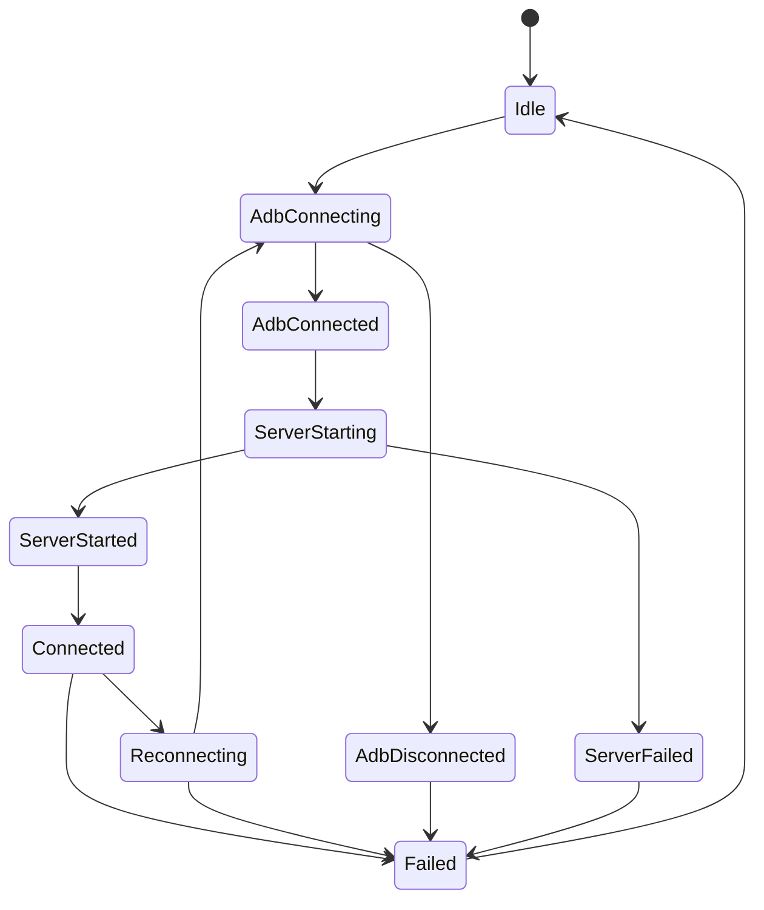

# 会话状态与事件

相关文档：

- [架构原则](principles.md)
- [运行时主链路](runtime.md)
- [排障方法](../04-analysis/troubleshooting.md)
- [USB 与 TLS 时序](../05-handoff/timelines.md)

## 文档目的

这一篇专门解释会话运行时里的三层信息：

1. 主状态 `SessionState`
2. 过程事实 `SessionEvent`
3. 组件级快照 `SessionComponentStateSnapshot`

如果不把这三层分开，后续看日志、做重连、修边界都会混乱。

## 三层模型

### 第一层：主状态

主状态回答的是：

- 当前会话总体处于什么阶段

这层由 `SessionState` 表达。

### 第二层：过程事实

过程事实回答的是：

- 刚刚发生了什么
- 哪一步成功或失败

这层由 `SessionEvent` 表达。

### 第三层：组件快照

组件快照回答的是：

- 各个基础设施组件当前各自处于什么状态

这层由 `SessionComponentStateSnapshot` 和相关 read model 表达。

## 主状态 `SessionState`

当前主状态包括：

- `Idle`
- `AdbConnecting`
- `AdbConnected`
- `AdbDisconnected`
- `ServerStarting`
- `ServerStarted`
- `ServerFailed`
- `Connected`
- `Reconnecting`
- `Failed`

## 状态图

这不是所有分支的完整精确代码图，但足够表达当前运行时的主阶段切换。

## `Connected` 状态的技术含义

`Connected` 不是简单的“ADB 已通”，而是会话已经进入 scrcpy 运行态。

它当前包含：

- `localPort`
- `connectedSockets`
- `socketCount`
- `audioEnabled`
- `dummyByteConfirmed`

因此，`Connected` 更适合理解为：

- 基础通信链路已建立
- socket 视角下已经进入可工作区间

但是否真正可用，还要再结合 metadata 和 decoder 判断。

## 过程事实 `SessionEvent`

`SessionEvent` 当前分成 8 组。

### ADB 组

- `AdbConnecting`
- `AdbVerifying`
- `AdbConnected`
- `AdbDisconnected`

作用：

- 表达底层连接和验证阶段的事实

### Server 组

- `ServerPushing`
- `ServerPushed`
- `ServerPushFailed`
- `ServerStarting`
- `ServerStarted`
- `ServerFailed`

作用：

- 表达 server 上传、启动和异常事实

### Forward 组

- `ForwardSetting`
- `ForwardSetup`
- `ForwardRemoved`
- `ForwardFailed`

作用：

- 表达端口转发建立与移除

### Socket 组

- `SocketConnecting`
- `SocketConnected`
- `SocketDisconnected`
- `SocketError`

作用：

- 表达 video/audio/control socket 的生命周期

### Decoder 组

- `DecoderStarted`
- `DecoderStopped`
- `DecoderError`

作用：

- 表达媒体链路进入或退出可运行状态

### Control 组

- `RequestReconnect`
- `RequestCleanup`

作用：

- 表达运行时决策，而不是简单的底层事实

### Codec 组

- 视频和音频编码器检测开始、成功、失败、运行时错误

作用：

- 表达设备能力探测和自动选择过程

### Session 组

- `SessionError`

作用：

- 表达无法更细分到某个基础设施子域的会话级异常

## 事件到状态的关系

一个实用原则是：

- `SessionEvent` 更像输入
- `SessionState` 更像归纳后的结果

例如：

- `AdbConnected` 事件发生后，主状态可能进入 `AdbConnected`
- `ServerStarted` 事件发生后，主状态可能进入 `ServerStarted`
- `RequestReconnect` 事件发生后，主状态可能进入 `Reconnecting`

因此调试时不要只盯其中一层。

## 组件级快照

当前组件级状态主要围绕这些组件：

- `AdbConnection`
- `ScrcpyServer`
- `VideoSocket`
- `AudioSocket`
- `ControlSocket`
- `VideoDecoder`
- `AudioDecoder`

每个组件状态目前使用 `ComponentState` 表达：

- `Idle`
- `Starting`
- `Running`
- `Connected`
- `Stopped`
- `Disconnected`
- `Error(message)`

## 组件快照派生读模型

当前有三类重要的派生读模型。

### `InfrastructureConnectionReadModel`

关注：

- ADB 是否已连接
- server 是否正在运行
- 是否已具备 socket 建链前提

其中 `isReadyForSocketConnect` 的含义是：

- `adbState == Connected`
- `serverState == Running`

### `SocketConnectionReadModel`

关注：

- 哪些 socket 已连接
- video socket 是否已连
- 所需 socket 是否已全部满足

### `DecoderConnectionReadModel`

关注：

- 哪些 decoder 正在运行
- 哪些 decoder 已停止

## 一个推荐的调试视角

排查问题时，优先按下面的层次看：

1. 当前 `SessionState` 停在哪
2. 最后一个关键 `SessionEvent` 是什么
3. 各组件快照里哪个组件没有进入预期状态

这样比只看一长串日志更容易定位。

## Issue 模型的作用

当前 issue 模型已经按领域拆分：

- `AdbIssue`
- `ServerIssue`
- `ForwardIssue`
- `SocketIssue`
- `DecoderIssue`
- `SessionIssue`
- `ReconnectIssue`
- `CodecIssue`

这意味着：

- 不应再把所有失败都压成统一字符串
- 失败应尽量先归到所属子域

## 常见误区

### 误区一

把 `Connected` 误解为“全链路一定已经可用”。

实际上它只表示运行时已进入较后阶段，还需要结合 metadata 与 decoder。

### 误区二

只看 `SessionState` 不看 `SessionEvent`。

这样会丢失过程信息。

### 误区三

只看 `SessionEvent` 不看组件快照。

这样会丢失当前各子组件的最终落点。

## 一句话总结

会话运行时真正稳定的前提，不是状态或事件越多越好，而是让主状态、过程事实和组件快照三层各自负责、彼此配合。
