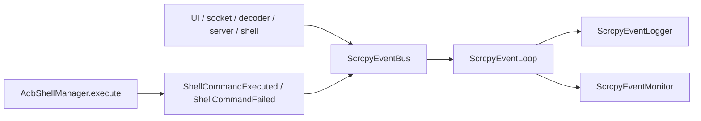

# 事件系统与 Shell 接入

相关文档：

- [运行时主链路](../02-architecture/runtime.md)
- [事件流、监控与采样](event-flow.md)
- [排障方法](../04-analysis/troubleshooting.md)
- [工程规则](../07-steering/engineering.md)

## 事件与 Shell 的关系图

## 事件系统的定位

事件系统适合承担三件事：

- 跨线程通信
- 统一日志输出
- 状态观测与调试

它不适合直接成为业务唯一状态机。

当前核心对象包括：

- `ScrcpyEventBus`
- `ScrcpyEventLoop`
- `ScrcpyEventLogger`
- `ScrcpyEventMonitor`

其中 `ScrcpyEventBus` 是单例入口，内部持有 `ScrcpyEventLoop`，并维护按 `deviceId` 归档的 `DeviceMonitorState`。

`ScrcpyEventBus` 当前还提供：

- `start()`
- `stop()`
- `cleanup()`
- `getDeviceState(deviceId)`
- `clearDeviceState(deviceId)`
- `getStateSummary(deviceId)`

## 使用事件系统时的判断标准

新增事件前，先判断它属于哪一类。

### 适合进入事件系统的内容

- 用户输入
- 生命周期通知
- 监控数据
- 组件状态变化
- 调试信号

当前事件总线还承担两类 native 回调入口：

- `emitStatusFromNative(...)`
- `emitErrorFromNative(...)`

### 不适合直接依赖事件系统解决的内容

- 持久化配置逻辑
- 会话唯一业务真相
- 需要严格顺序和状态约束的核心运行时决策

## 事件使用建议

1. 高频事件必须考虑采样。
2. 事件分类和日志级别应一致。
3. 会话结束时要同步清理相关状态。
4. 事件命名应直接表达事实，不要混入推断。

实际开发里，最常见的错误是：

- 把业务状态直接藏进日志字符串
- 把监控投影误当作业务真相
- 忘记按 `deviceId` 清理状态

## 事件接入检查表

新增一个事件或监控点时，建议检查：

1. 这个事实是不是应该先进 `SessionEvent`
2. 它是否只是调试或监控投影
3. 是否需要带 `deviceId`
4. 是否会高频触发
5. 会话结束时是否需要清理对应状态

## Shell 管理器的定位

Shell 管理器是所有 shell 命令的统一入口。

它的价值在于：

- 降低命令执行路径分散
- 统一记录耗时和结果
- 让日志和监控更完整

当前 `AdbShellManager.execute(...)` 会记录：

- `deviceId`
- `command`
- `durationMs`
- `success`
- 输出或错误

默认情况下，它会把结果推到事件系统中：

- 成功时发 `ShellCommandExecuted`
- 失败时发 `ShellCommandFailed`

如果调用方希望减少噪音，可以通过参数关闭事件上报或重试。

## 何时应走 Shell 管理器

只要是常规 ADB shell 命令，优先都应走统一管理器，而不是在业务代码里直接拼接和执行。

原因很直接：

- 更容易审计
- 更容易排障
- 更方便统计失败率和执行时间

当前已封装的常用能力包括：

- `getProperty`
- `wakeUpScreen`
- `expandNotifications`
- `setClipboard`
- `killProcess`
- `chmod`
- `heartbeat`
- `verifyConnection`

## 开发时的推荐顺序

新增一段 shell 相关功能时，建议按下面顺序处理：

1. 确认这是不是通用能力
2. 如果是通用能力，放入统一管理器
3. 给出统一的日志和事件上报
4. 再在具体业务中调用

## 需要避免的做法

- 在不同功能模块里重复写同类 shell 调用
- shell 失败后只打字符串日志，不留下结构化结果
- 把 shell 结果直接和 UI 状态耦死

## 关键代码落点

如果要修改这一层，优先关注：

- `core/common/event/ScrcpyEventBus.kt`
- `core/common/event/ScrcpyEventLoop.kt`
- `infrastructure/adb/shell/AdbShellManager.kt`

## 典型使用方式

### 适合放进 Shell 管理器的命令

- `getprop`
- 输入控制
- 状态栏命令
- 心跳命令
- 进程清理

### 不适合直接放进业务代码的原因

- 失败无法统一统计
- 耗时无法统一采样
- 事件和日志无法统一归档

## 一句话总结

事件系统解决的是通信和观测，Shell 管理器解决的是命令统一入口；两者都应该服务于运行时主链路，而不是各自再长出一套独立业务逻辑。
