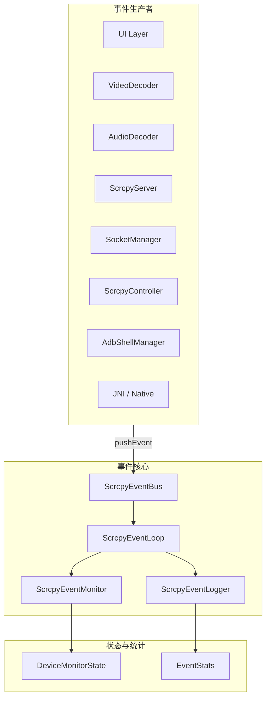

# 事件流、监控与采样

相关文档：

- [事件系统与 Shell 接入](event-and-shell.md)
- [会话状态与事件](../02-architecture/session-state.md)
- [日志与信号字典](../04-analysis/logs-and-signals.md)

## 文档目的

这一篇专门解释事件系统内部的流转方式，而不是只讲“怎么调用”。

重点包括：

- 谁在产生日志与事件
- 事件进入总线后如何流转
- 监控器和日志器各自负责什么
- 高频事件为什么要采样

## 事件系统结构图

## 核心对象与职责

### `ScrcpyEventBus`

职责：

- 统一接收事件
- 暴露线程安全的 `pushEvent`
- 管理事件循环生命周期
- 提供按 `deviceId` 查询的监控状态

关键接口：

- `start()`
- `stop()`
- `cleanup()`
- `pushEvent(event)`
- `postToMainThread { ... }`
- `getDeviceState(deviceId)`
- `getStateSummary(deviceId)`

### `ScrcpyEventLoop`

职责：

- 真正承接事件队列
- 分发给日志器和监控器

当前实现使用 Kotlin `Channel`，作用上替代 SDL 风格事件循环。

### `ScrcpyEventLogger`

职责：

- 统一日志级别过滤
- 高频事件采样
- 事件统计
- 日志格式化

### `ScrcpyEventMonitor`

职责：

- 监听监控类事件
- 更新 `DeviceMonitorState`
- 维护 shell、socket、frame、screen、exception 等投影状态

它是“状态投影器”，不是主业务状态机。

## 流转顺序

事件进入总线后的典型流转顺序是：

1. 生产者调用 `pushEvent`
2. `ScrcpyEventBus` 交给 `ScrcpyEventLoop`
3. `ScrcpyEventLogger` 判断是否记录日志
4. `ScrcpyEventMonitor` 判断是否更新监控状态
5. UI 或调试工具查询 `DeviceMonitorState`

## 事件分类

当前事件类型大致分成五类：

- UI 事件
- 监控事件
- 生命周期事件
- 媒体事件
- 系统事件

各类事件的日志级别应与其频率和重要性相匹配：

- `VERBOSE`
  高频媒体或 socket 事件
- `DEBUG`
  调试和命令类事件
- `INFO`
  建链、状态切换、重要设备状态
- `WARN`
  超时、断连、降级
- `ERROR`
  明确失败和异常

## 采样规则

当前 `ScrcpyEventLogger` 使用固定采样间隔：

- `SAMPLING_INTERVAL = 100`

也就是高频事件默认每 100 次输出 1 次。

## 为什么要采样

不采样时，高频事件会带来三个问题：

1. 日志刷屏，掩盖关键故障信号
2. I/O 成本过高
3. 排障时更难从日志里还原主链路

因此采样不是“少看点日志”，而是让高频事件和关键事件并存时仍然可读。

## 适合采样的事件

典型包括：

- 鼠标/触摸移动
- socket 收发
- 视频帧解码
- 音频帧解码

## 不应采样的事件

通常不应采样：

- 连接建立
- 连接丢失
- decoder 错误
- server 启动失败
- shell 命令失败

这些事件量不大，但诊断价值很高。

## `ScrcpyEventMonitor` 当前维护的关键投影

### Shell 维度

- shell 执行次数
- shell 失败次数
- 最后一次命令

### Forward 维度

- forward 建立次数
- forward 失败次数
- forward 移除次数

### 文件推送维度

- 推送次数
- 总字节数
- 最后一次远端路径

### Socket 维度

- 每类 socket 的 bytes / packets 收发统计
- idle 次数

### 媒体维度

- 视频帧数
- 音频帧数
- video/audio active 状态
- stall 次数

### 设备状态维度

- 是否连接
- 是否亮屏
- 是否锁屏
- 最近异常列表

## 什么时候应该进事件系统

适合进事件系统的内容：

- 观测点
- 高频输入
- native / shell / socket / server 产生的监控事实
- 需要被日志和监控统一消费的信号

不适合直接依赖事件系统承接的内容：

- 会话唯一业务状态
- 配置持久化
- 强一致的运行时主流程决策

## 一个判断标准

如果某个信息满足下面任意一点，就更适合先进 `SessionEvent` 而不是只进事件总线：

- 它会改变会话主状态
- 它会触发重连或 cleanup
- 它会决定是否继续推进主链路

## 一句话总结

事件系统的正确定位，是“统一观测和跨线程通信平台”；一旦把它重新当成主业务状态机，运行时边界又会开始变乱。
