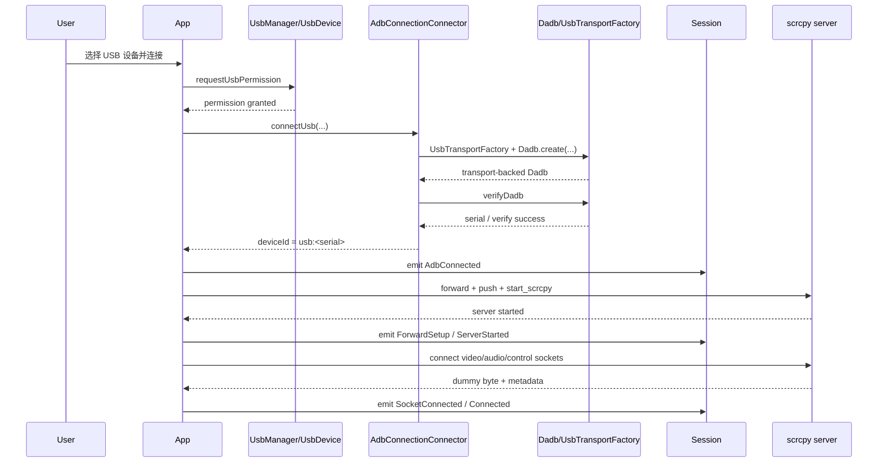
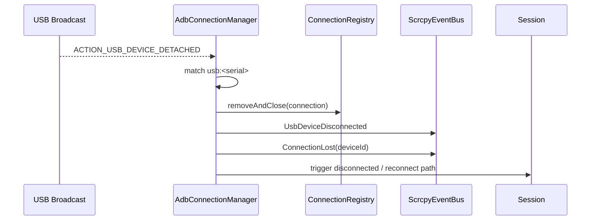
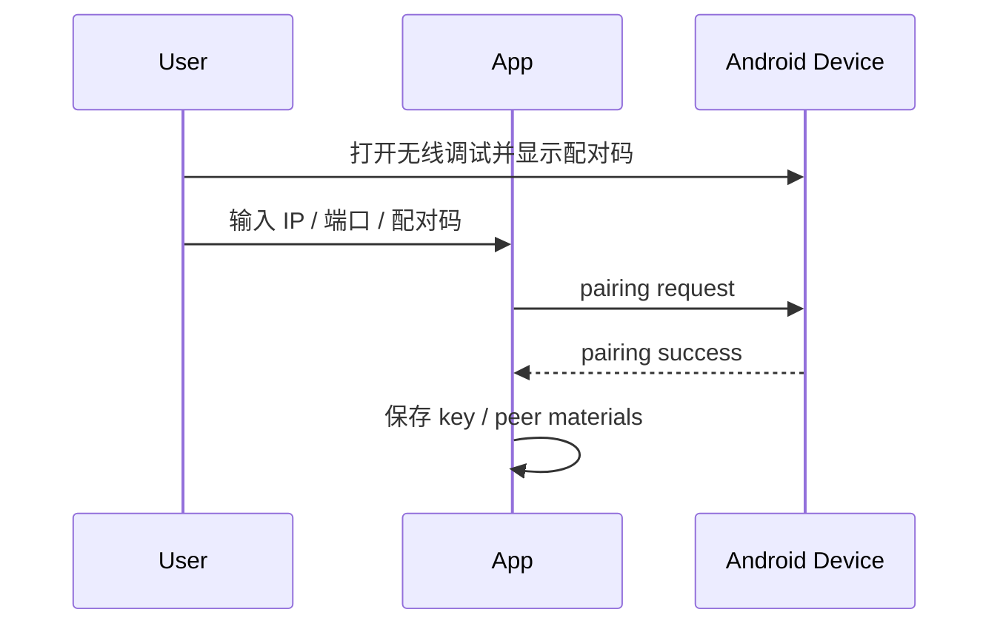
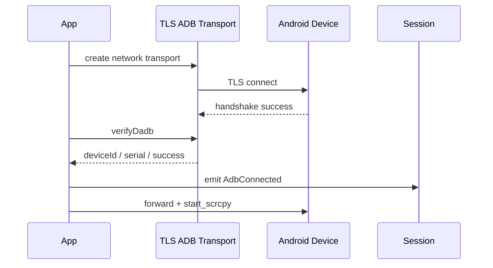

# USB 与 TLS 时序

相关文档：

- [USB 与 Wireless Debugging 当前状态](usb-and-wireless.md)
- [运行时主链路](../02-architecture/runtime.md)
- [会话状态与事件](../02-architecture/session-state.md)

## 文档目的

这一篇不讲高层概念，专门讲时序。

重点覆盖两条线：

1. USB Host + dadb + scrcpy
2. Wireless Debugging pairing + TLS connect

时序文档的价值在于：

- 明确每一步先后关系
- 明确哪一步失败会影响后续哪一层
- 明确不要把不同阶段的问题混为一类

## USB 连接时序

## USB 断连时序

这里最重要的工程含义是：

- 物理 detach 是硬信号
- registry 清理必须及时
- 事件推送应跟清理动作对齐

## Wireless Debugging 时序

### 配对阶段

### 连接阶段

## 必须分开的两个阶段

Wireless Debugging 的排查必须先分清：

1. pairing 阶段
2. connect 阶段

否则很容易出现这种误判：

- pairing 成功，被误解为后续连接一定成功
- connect 失败，被误解为配对能力本身有问题

## 时序上的关键判断点

### USB 线

- 权限是否真正授予
- transport 是否真正创建
- `verifyDadb` 是否通过
- `usb:<serial>` 是否统一
- socket 是否按顺序连齐

### Wireless Debugging 线

- pairing 是否产出有效材料
- connect 是否进入 TLS
- verify 是否成功
- pin 流程是否执行

## 从时序看最常见的错误

### 错误一：把连接成功等同于协议就绪

TCP 或 USB transport 连上，不代表 metadata 和 decoder 已经就绪。

### 错误二：把配对成功等同于连接成功

pairing 和 connect 是两个阶段。

### 错误三：把逻辑结束和物理失效混为一类

主动结束会话和 USB detach 不能共用一套处理分支。

## 一句话总结

只要把 USB 和 TLS 的时序拆开来看，很多原本像“随机异常”的问题，其实都能被还原为某一个明确阶段的边界错误。
