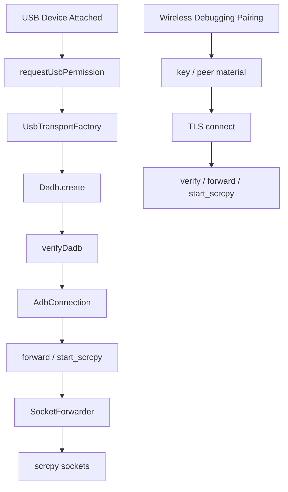

# USB 与 Wireless Debugging 当前状态

相关文档：

- [运行时主链路](../02-architecture/runtime.md)
- [会话状态与事件](../02-architecture/session-state.md)
- [排障方法](../04-analysis/troubleshooting.md)
- [USB 与 TLS 时序](timelines.md)
- [开放问题与后续项](open-issues.md)
- [协作规则](../07-steering/collaboration.md)

## 当前连接路径图

## 当前状态判断

项目当前已经跨过“主链路能不能跑通”的阶段，进入“边界是否稳定、路径是否统一”的阶段。

这意味着后续工作重点不是重复验证基础能力，而是继续清理生命周期和连接策略边界。

## USB 主链路现状

当前 USB Host 场景下，主链路已经具备完整可用性：

- USB 可枚举
- 权限可申请
- ADB 可握手
- shell 可执行
- server 可启动
- 视频可建立
- 控制可建立

这是当前最重要的基础结论。

在代码上，USB 线最值得优先关注的对象包括：

- `AdbConnectionConnector`
- `AdbConnectionManager`
- `SocketForwarder`
- `ScrcpyServiceHeartbeatMonitor`

当前更具体的路径是：

1. 申请 USB 权限
2. 刷新可用 USB 设备对象
3. 通过 `UsbTransportFactory` 创建 transport
4. 使用 `Dadb.create(...)` 创建连接
5. 执行 `verifyDadb`
6. 放入连接注册表
7. 继续走 forward 和 scrcpy 主链路

## USB 线真正重要的后续问题

现在 USB 线最值得继续盯住的，不是首次连接，而是失效处理。

重点包括：

- 物理拔线后的 transport 生命周期
- 坏连接是否及时移除
- 是否误把 USB 失效当成普通会话结束
- 是否错误沿用 TCP/IP 的重连模型

其中最关键的工程判断是：

- `ACTION_USB_DEVICE_DETACHED` 应优先视为 transport 失效信号
- heartbeat 只应作为兜底，不应继续承担主检测职责

当前 `AdbConnectionManager` 已对 `ACTION_USB_DEVICE_DETACHED` 注册广播接收，并在识别到匹配连接后：

1. 标记 transport disconnected
2. 从连接池移除并关闭连接
3. 推送 `UsbDeviceDisconnected`
4. 推送 `ConnectionLost`

这条链路是 USB 稳定性的关键，不应再被其他“软判断”覆盖。

## 设备身份约束

USB 设备身份需要稳定统一。

推荐理解方式是：

- 会话层、连接层、保活层都使用同一套 USB 设备标识

如果不同层对同一设备使用不同表示法，后续连接复用、断连清理和状态追踪都会变得不可靠。

当前推荐统一为：

- `usb:<serial>`

## Wireless Debugging 现状

Wireless Debugging 当前也已经进入“可用但仍需收口细节”的阶段。

核心结论：

- pairing 已可完成
- TLS 连接已可建立
- 端口不应再被理解为固定值

当前工程含义是：

- pairing 成功后，应保存并复用必要的密钥和 peer 材料
- connect 阶段再进入真正的 TLS 建链和 pin 相关逻辑

这意味着：

- 不能再通过固定端口推断 TLS 与否
- pairing 结果应被视为 connect 的前置材料，而不是 connect 成功本身

## Wireless Debugging 后续重点

后续最应继续做清楚的，是三件事：

1. pairing 与 connect 的边界
2. pin 的学习与校验流程
3. 失败路径的提示和观测

## 接手建议

### 先确认是不是回归

不要重新回到已经被验证通过的基础问题，除非出现新的实证回归。

### 先看 transport 边界

USB 问题优先看 transport 生命周期，不要一上来怀疑 UI 或 decoder。

### 先分阶段再排查

Wireless Debugging 问题要先分清：

- pairing 阶段
- connect 阶段
- pin 校验阶段

### 先看真实状态，再决定是否回滚路径

当前正式主路径已经是新 transport 路径，因此除非明确发现回归，不要轻易回退到历史调试路径。

## 接手时最应优先验证的信号

### USB

- 是否收到 detach 广播
- 是否正确匹配到 `usb:<serial>`
- 坏连接是否从 registry 移除
- 后续重连是否走新 transport 路径

### Wireless Debugging

- pairing 是否真正产出密钥材料
- connect 是否进入 TLS 建链
- pin 学习或校验是否有明确结果

## 一句话总结

当前项目的连接主链路已经可用，接下来最关键的是把 USB 和 Wireless Debugging 的生命周期边界、错误边界和重连边界继续收紧。
