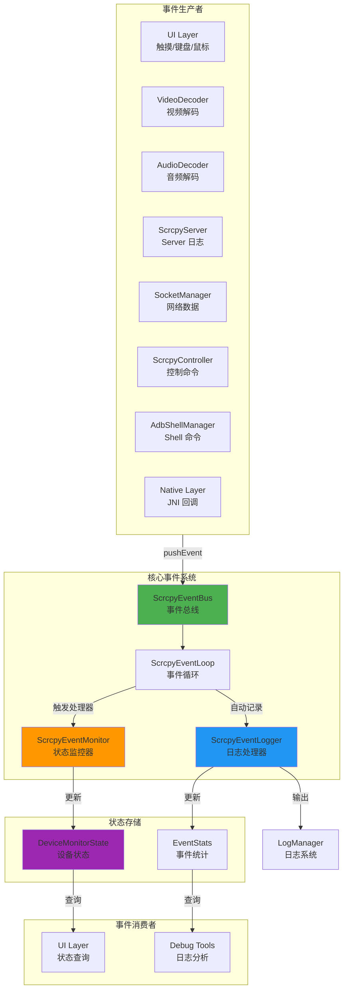
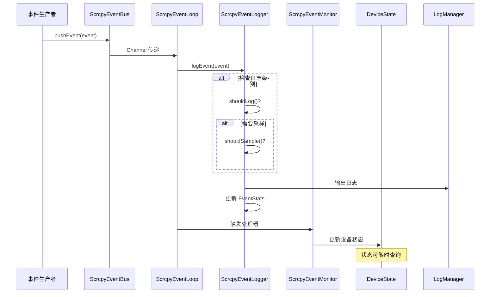
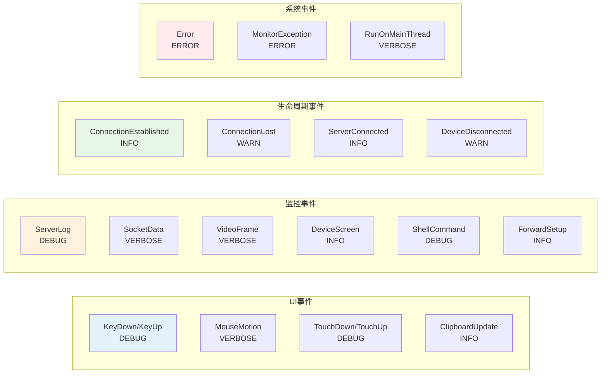
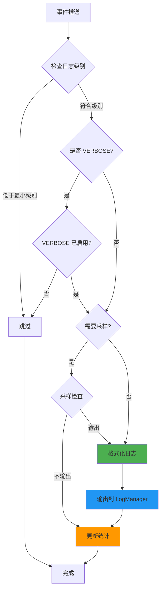
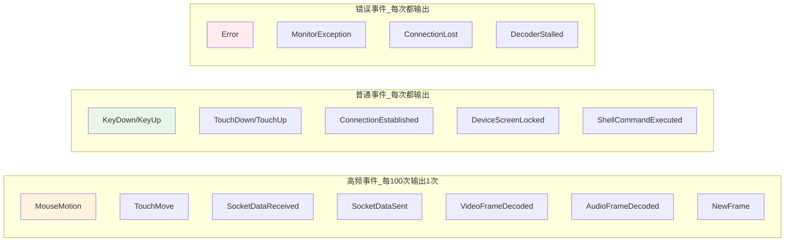
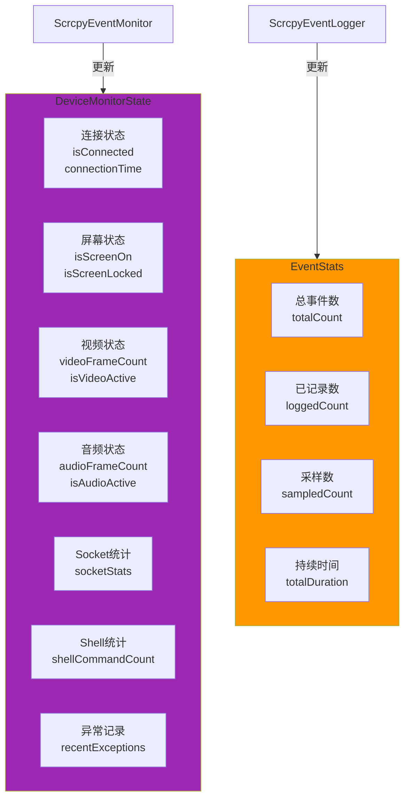

# SDL 事件系统完整架构

## 系统架构图



## 事件处理流程



## 事件分类与日志级别



## 日志输出流程



## 采样策略



## 状态管理



## 关键特性

| 特性 | 说明 |
|------|------|
| **事件分类** | UI/监控/生命周期/系统四大类 |
| **日志级别** | VERBOSE/DEBUG/INFO/WARN/ERROR |
| **自动日志** | 所有事件自动记录，无需手动调用 |
| **智能采样** | 高频事件自动采样（每 100 次） |
| **状态管理** | 自动维护设备状态和事件统计 |
| **级别控制** | 支持动态调整日志级别 |
| **性能监控** | 自动统计事件频率和耗时 |
| **线程安全** | 可从任意线程推送事件 |

## 使用示例

### 配置日志级别

```kotlin
// 只输出 INFO 及以上
ScrcpyEventLogger.setMinLogLevel(ScrcpyEvent.LogLevel.INFO)

// 启用 VERBOSE（包含高频事件）
ScrcpyEventLogger.setVerboseEnabled(true)
```

### 推送事件

```kotlin
// UI 事件
ScrcpyEventBus.pushEvent(
    ScrcpyEvent.TouchDown(pointerId = 0, x = 100f, y = 200f)
)

// 监控事件（自动采样）
ScrcpyEventBus.pushEvent(
    ScrcpyEvent.VideoFrameDecoded(deviceId, 1080, 2400, pts)
)

// 生命周期事件
ScrcpyEventBus.pushEvent(
    ScrcpyEvent.ConnectionEstablished(deviceId)
)
```

### 查询状态

```kotlin
// 设备状态
val state = ScrcpyEventBus.getDeviceState(deviceId)
println("视频帧数: ${state.videoFrameCount}")

// 事件统计
val stats = ScrcpyEventLogger.getEventStats("VideoFrameDecoded")
println("总计: ${stats?.totalCount}, 已记录: ${stats?.loggedCount}")
```

## 快速定位

- **文档**：`docs/EVENT_SYSTEM_GUIDE.md` - 使用指南
- **架构**：`docs/EVENT_ARCHITECTURE.md` - 本文档
- **流程**：`docs/SDL_EVENT_FLOW.md` - 原始流程图
- **代码**：`core/common/event/` - 事件系统实现
