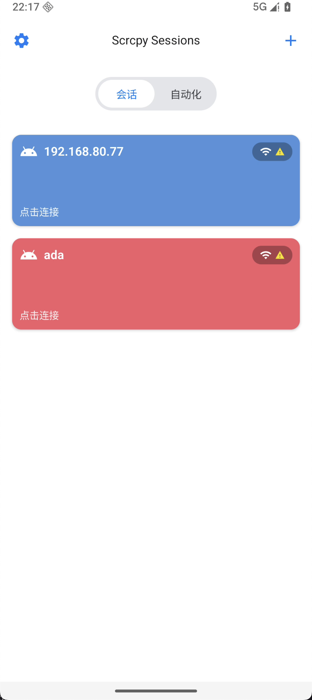
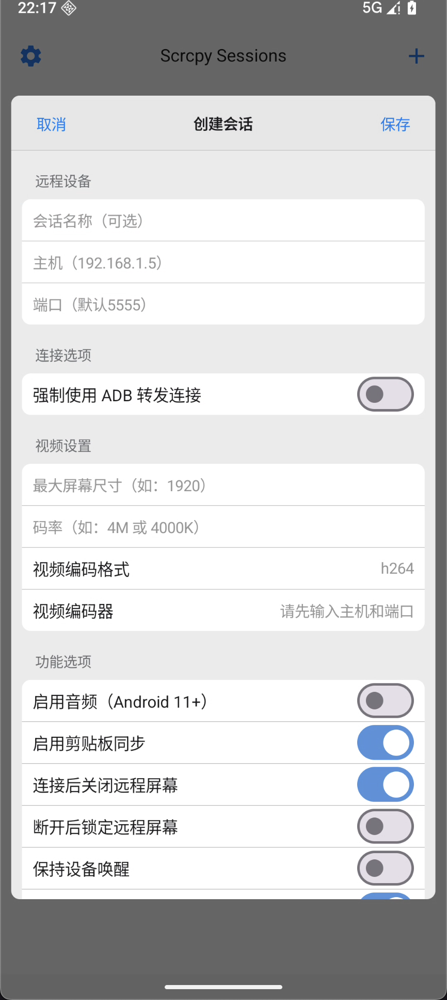

# Scrcpy Mobile

基于 Scrcpy 协议的 Android 设备间远程控制应用，采用现代化模块化架构。

## 预览

<p align="center">
  
  
  
</p>

## 核心特性

- 🎯 Android 设备间远程控制（无需 PC）
- 🎨 iOS 风格 UI 设计（Material 3）
- 🌐 双语支持（中文/英文）
- 📱 会话管理与分组
- 🎮 多功能手势控制
- 🔧 编解码器自定义配置

## 快速开始

### 环境要求

- Android Studio Hedgehog+
- JDK 21
- Android SDK 34
- NDK 25.x+
- CMake 3.22+

### 构建项目

```bash
git clone <repository-url>
cd scrcpy-mobile
./gradlew assembleDebug
```

## 项目架构

采用 **Google Now in Android** 推荐的模块化架构：

```
app/              # 应用入口
feature/          # 功能模块（会话、远程控制、设备、设置）
infrastructure/   # 基础设施（ADB、Scrcpy、媒体）
core/             # 核心基础（通用工具、设计系统、领域模型）
service/          # Android 服务
```

详见 [架构文档](ARCHITECTURE.md)

## 文档导航

### 核心文档
- [架构设计](ARCHITECTURE.md) - 模块化架构详解
- [开发计划](TODO.md) - 功能规划与进度
- [设备配对](DEVICE_PAIRING.md) - ADB 无线配对指南

### 技术文档
- [事件系统](EVENT_SYSTEM_GUIDE.md) - ScrcpyEventBus 使用指南
- [Shell 管理](SHELL_MANAGER_GUIDE.md) - ADB Shell 命令管理
- [事件流程](SDL_EVENT_FLOW.md) - SDL 风格事件系统架构图

### 对比分析
- [ScrcpyVS/](ScrcpyVS/) - 与其他项目的技术对比分析

## 开发进度

正在开发中 `60%` - 详见 [TODO.md](TODO.md)

## 备忘录

```regexp
(?<!\bpackage\s)(?<!\bimport\s)com\.mobile\.scrcpy\.android\.
```

## 贡献

目前由作者独立开发，暂时闭源。后期如有贡献者会考虑开源。

## 许可证

待定
