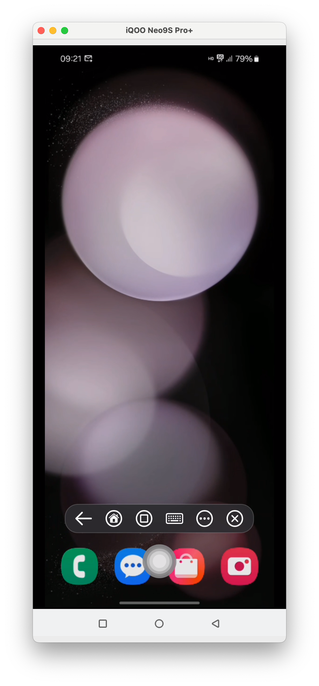
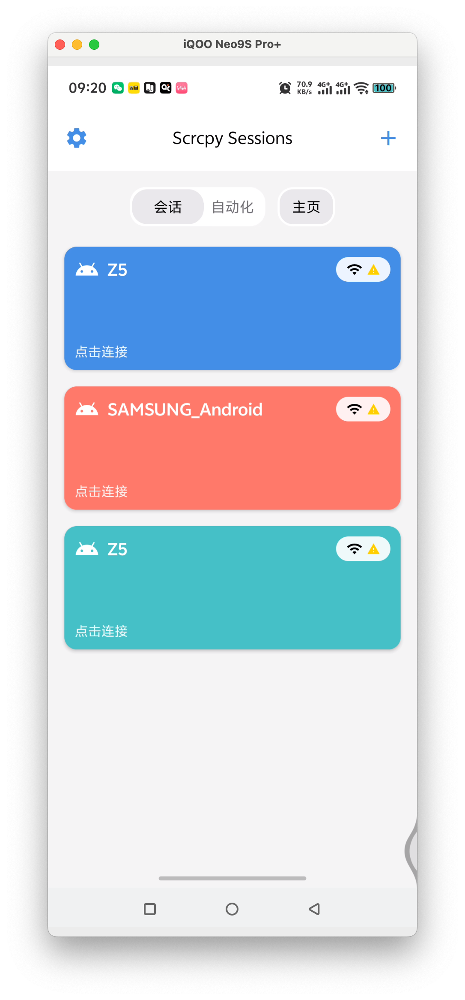
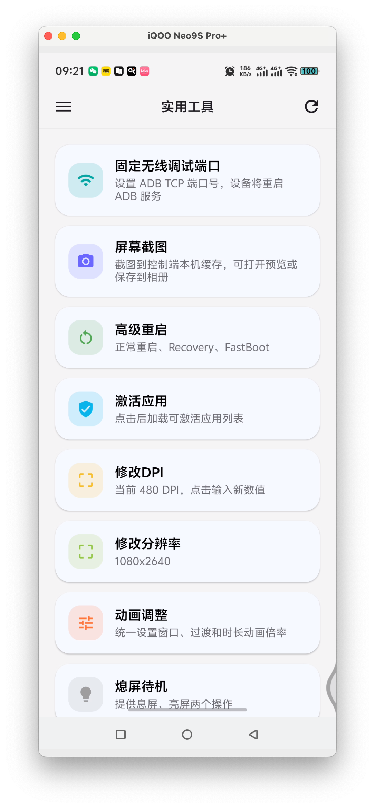
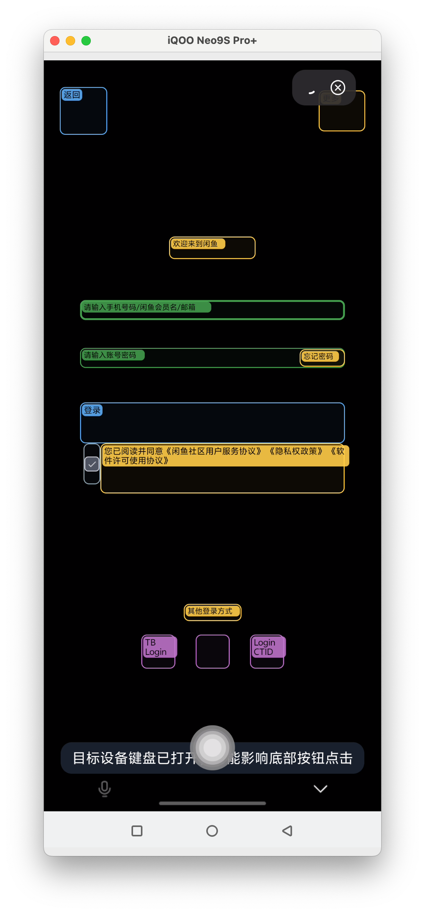

# Scrcpy Mobile

Scrcpy Mobile 是一个运行在 Android 设备上的远程控制应用。

它基于 scrcpy 协议链路，把设备连接、会话配置、屏幕镜像、控制输入，以及一组常用调试工具整理进同一个
Android 客户端里，适合做日常远控、联调和问题排查。

## 可以做什么

- 管理多台设备和多组会话配置
- 通过 ADB、USB Host、Wireless Debugging 建立连接
- 查看远端画面，并发送触摸、按键和输入操作
- 查看设备信息、执行 Shell、管理应用和文件
- 使用布局检查等辅助能力做调试

## 界面预览

以下截图来自当前版本的 Android 客户端。

<table>
  <tr>
    <td align="center"></td>
    <td align="center"></td>
    <td align="center"></td>
  </tr>
  <tr>
    <td align="center"></td>
    <td align="center"></td>
    <td align="center"></td>
  </tr>
  <tr>
    <td align="center"></td>
    <td align="center"></td>
    <td></td>
  </tr>
</table>

## 建议先看

如果你只是想快速了解这个项目，建议先读：

- [项目定位](01-overview/project.md)
- [能力范围](01-overview/capabilities.md)
- [快速开始](01-overview/getting-started.md)

如果你想继续深入实现细节，可以再看：

- [技术索引](TECHNICAL_INDEX.md)
- [架构文档](02-architecture/README.md)
- [开发指南](03-guides/README.md)
- [分析与排障](04-analysis/README.md)

## 文档说明

- `docs/` 是当前主文档目录。
- 更偏阶段记录和工程协作的内容，可以继续查看 `05-handoff/`、`06-research/` 和 `07-steering/`。
