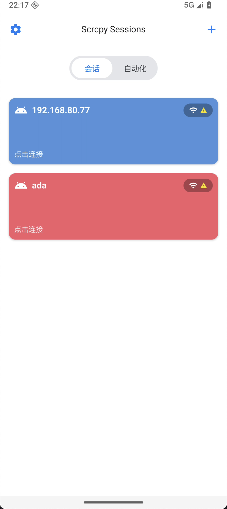
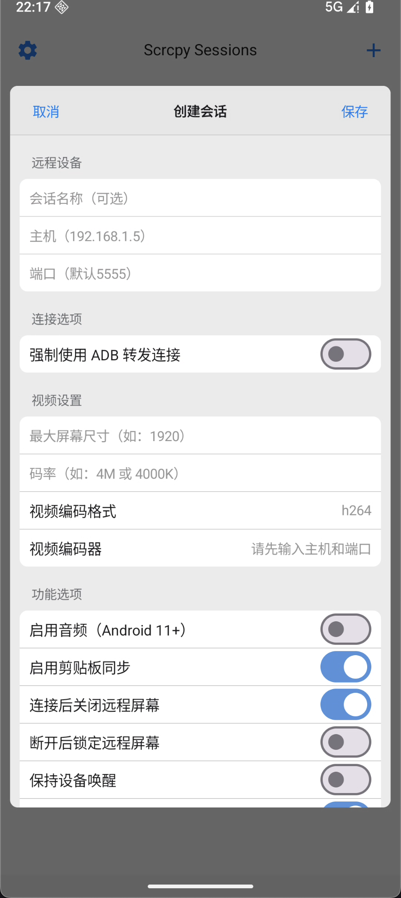
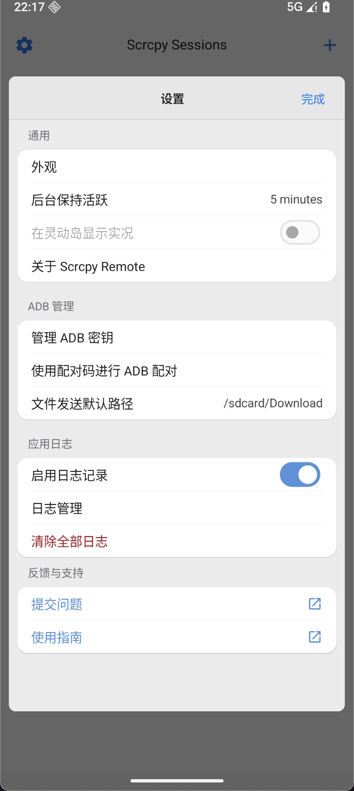

## 预览

  
  
  

AI 不需要看这份文档，也不需要更新这份文档

## 正在进行：

- [ ] 完善 adb 功能
- [ ] 完善 scrcpy 页面点击电源按键后 按其他案件无反应
- [ ] 完善 scrcpy 页面 菜单去除电源按钮

## 需要完善的功能

- [x] 生成新的密钥对 显示的内容需要调整
- [x] 打开的窗口高度 需同步
- [x] 生成新的密钥对 显示的内容需要调整