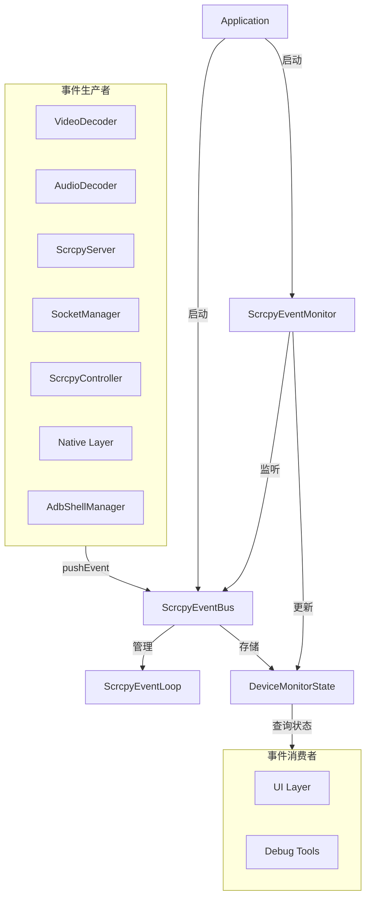
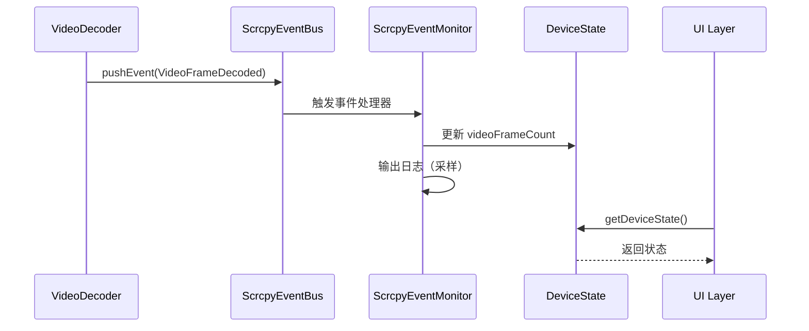
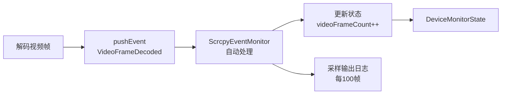
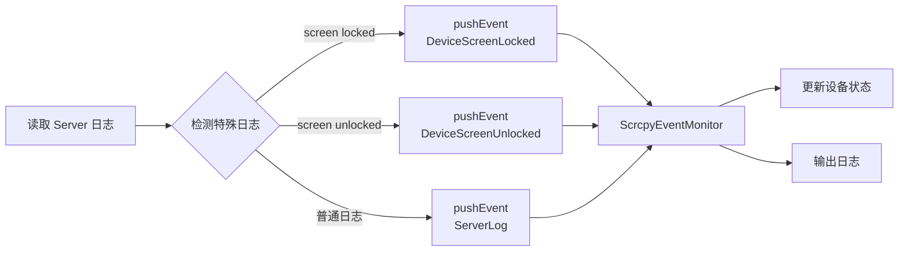
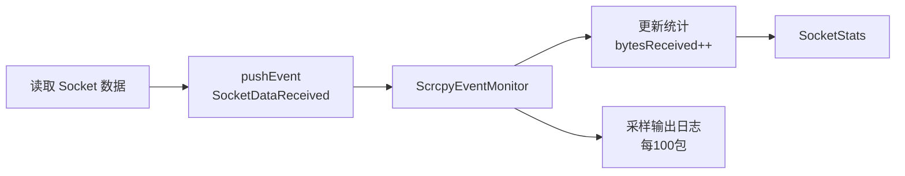
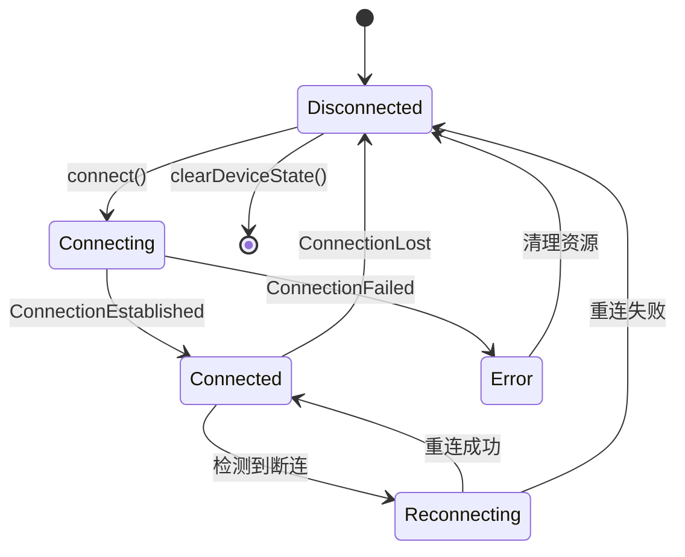
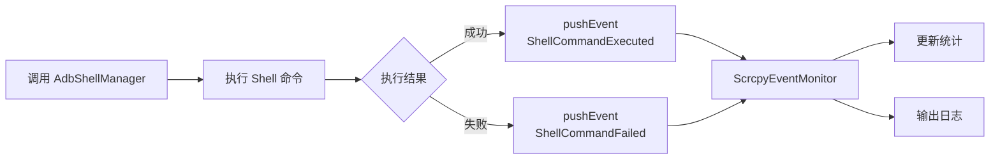
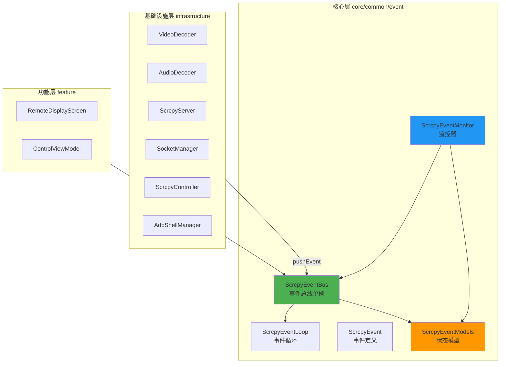
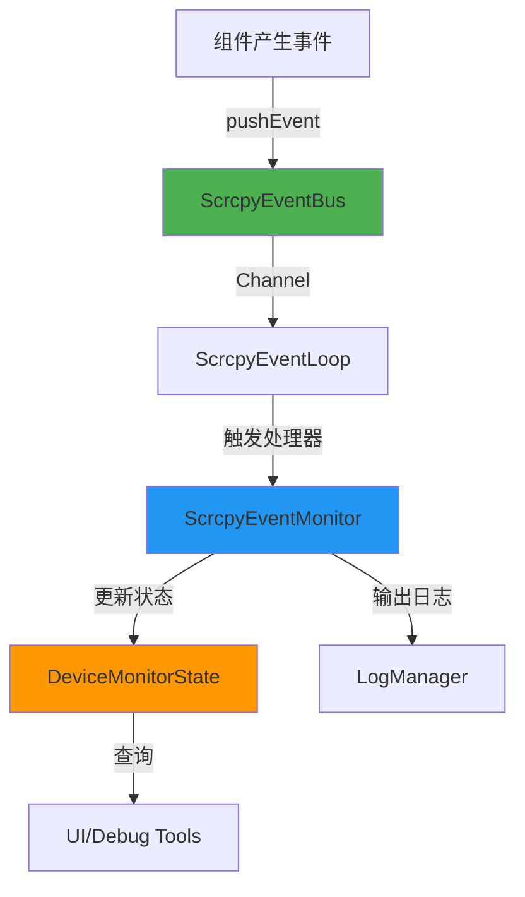

# SDL 事件系统架构图

## 系统架构

## 事件流转

## 视频解码流程

## Server 日志监控流程

## Socket 数据监控流程

## 连接生命周期

## Shell 命令执行流程

## 组件关系

## 数据流向

## 关键特性

| 特性        | 说明                              |
|-----------|---------------------------------|
| **单向数据流** | 组件 → EventBus → Monitor → State |
| **自动监控**  | Monitor 自动处理所有监控事件              |
| **状态查询**  | 任意组件可查询实时状态                     |
| **采样输出**  | 高频事件每 100 次输出一次                 |
| **异常追踪**  | 统一记录所有异常                        |
| **会话级**   | 随连接会话启动/停止                      |
| **多设备支持** | 通过 deviceId 区分设备                |

## 快速定位

- **称呼**：ScrcpyEventBus / SDL 事件系统
- **位置**：`core/common/event/`
- **文档**：`docs/EVENT_SYSTEM_GUIDE.md`
- **流程**：`docs/SDL_EVENT_FLOW.md`（本文档）
- **Shell 管理**：`docs/SHELL_MANAGER_GUIDE.md`
