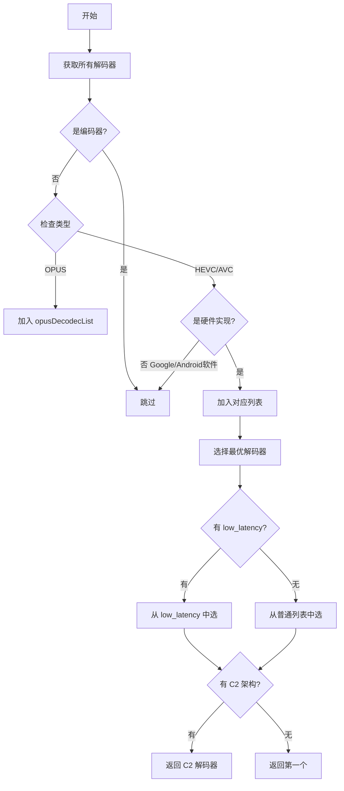

# 编解码器选择策略对比

## 核心差异总结

| 维度 | Easycontrol | 官方 Scrcpy |
|------|-------------|-------------|
| **策略** | 主动检测 + 智能选择 | 被动接受 + 用户指定 |
| **硬件优先** | 强制硬件编解码器 | 允许软件编解码器 |
| **低延迟优化** | 优先选择 low_latency 解码器 | 无特殊处理 |
| **C2 优先** | 优先选择 C2 架构 | 无特殊处理 |
| **软件编解码器** | 完全排除 Google 软件实现 | 允许使用 |

## Easycontrol 的智能选择策略

### 1. 客户端解码器选择（DecodecTools.java）



### 2. 核心代码分析

#### 硬件过滤逻辑
```java
// 排除 Google 和 Android 的软件实现
if (!codecName.startsWith("OMX.google") && !codecName.startsWith("c2.android")) {
    // 只添加硬件解码器
}
```

**排除的软件编解码器**：
- `OMX.google.*` - Google 的 OMX 软件实现
- `c2.android.*` - Android 的 Codec2 软件实现

**保留的硬件编解码器示例**：
- `c2.qti.hevc.decoder` - 高通硬件解码器
- `c2.mtk.hevc.decoder` - 联发科硬件解码器
- `OMX.qcom.video.decoder.hevc` - 高通 OMX 硬件解码器
- `OMX.MTK.VIDEO.DECODER.HEVC` - 联发科 OMX 硬件解码器

#### 优先级策略
```java
public static String getVideoDecoder(boolean h265) {
    ArrayList<String> allHardNormalDecodec = h265 ? hevcDecodecList : avcDecodecList;
    ArrayList<String> allHardLowLatencyDecodec = new ArrayList<>();
    
    // 1. 筛选低延迟解码器
    for (String codecName : allHardNormalDecodec) {
        if (codecName.contains("low_latency")) {
            allHardLowLatencyDecodec.add(codecName);
        }
    }
    
    // 2. 优先返回低延迟解码器
    if (allHardLowLatencyDecodec.size() > 0) {
        return getC2Decodec(allHardLowLatencyDecodec);
    }
    
    // 3. 否则返回普通硬件解码器
    if (allHardNormalDecodec.size() > 0) {
        return getC2Decodec(allHardNormalDecodec);
    }
    
    return "";
}

// C2 架构优先
private static String getC2Decodec(ArrayList<String> allHardDecodec) {
    for (String codecName : allHardDecodec) {
        if (codecName.contains("c2")) return codecName;
    }
    return allHardDecodec.get(0);
}
```

**选择优先级**：
1. 硬件 + low_latency + C2
2. 硬件 + low_latency + OMX
3. 硬件 + C2
4. 硬件 + OMX

### 3. 服务端编码器选择（EncodecTools.java）

```java
private static void getEncodecList() {
    for (MediaCodecInfo mediaCodecInfo : mediaCodecList.getCodecInfos()) {
        if (mediaCodecInfo.isEncoder()) {
            String codecName = mediaCodecInfo.getName();
            
            // OPUS: 通过名称匹配（宽松）
            if (codecName.toLowerCase().contains("opus")) {
                opusEncodecList.add(codecName);
            }
            
            // HEVC: 只要硬件实现
            if (!codecName.startsWith("OMX.google") && !codecName.startsWith("c2.android")) {
                for (String supportType : mediaCodecInfo.getSupportedTypes()) {
                    if (Objects.equals(supportType, MediaFormat.MIMETYPE_VIDEO_HEVC)) {
                        hevcEncodecList.add(codecName);
                    }
                }
            }
        }
    }
}
```

**特殊处理**：
- **OPUS 编码器**：使用名称匹配而非 MIME 类型，因为某些设备的 OPUS 编码器可能没有正确声明 MIME 类型
- **HEVC 编码器**：严格要求硬件实现

## 官方 Scrcpy 的被动策略

### 1. 编码器选择逻辑

```java
private static MediaCodec createMediaCodec(Codec codec, String encoderName) throws IOException {
    // 1. 如果用户指定了编码器名称，直接使用
    if (encoderName != null) {
        Ln.d("Creating encoder by name: '" + encoderName + "'");
        return MediaCodec.createByCodecName(encoderName);
    }
    
    // 2. 否则让系统自动选择
    MediaCodec mediaCodec = MediaCodec.createEncoderByType(codec.getMimeType());
    Ln.d("Using encoder: '" + mediaCodec.getName() + "'");
    return mediaCodec;
}
```

**特点**：
- 完全依赖 Android 系统的默认选择
- 不做任何硬件/软件过滤
- 不做性能优化
- 用户可通过 `--video-encoder` 和 `--audio-encoder` 参数手动指定

### 2. 编码器列表获取

```java
public static MediaCodecInfo[] getEncoders(MediaCodecList codecs, String mimeType) {
    List<MediaCodecInfo> result = new ArrayList<>();
    for (MediaCodecInfo codecInfo : codecs.getCodecInfos()) {
        if (codecInfo.isEncoder() && 
            Arrays.asList(codecInfo.getSupportedTypes()).contains(mimeType)) {
            result.add(codecInfo);
        }
    }
    return result.toArray(new MediaCodecInfo[result.size()]);
}
```

**特点**：
- 仅用于列出所有可用编码器（`--list-encoders`）
- 不做任何过滤和排序
- 包含软件和硬件编码器

## 实际设备对比

### 高通骁龙设备

#### Easycontrol 选择结果
```
Video Decoder (H265): c2.qti.hevc.decoder.low_latency
Video Decoder (H264): c2.qti.avc.decoder.low_latency
Audio Decoder (OPUS): c2.android.opus.decoder
```

#### 官方 Scrcpy 选择结果
```
Video Decoder (H265): c2.android.hevc.decoder (软件)
Video Decoder (H264): c2.android.avc.decoder (软件)
Audio Decoder (OPUS): c2.android.opus.decoder (软件)
```

### 联发科设备

#### Easycontrol 选择结果
```
Video Decoder (H265): c2.mtk.hevc.decoder
Video Decoder (H264): c2.mtk.avc.decoder
Audio Decoder (OPUS): OMX.MTK.AUDIO.DECODER.OPUS
```

#### 官方 Scrcpy 选择结果
```
Video Decoder (H265): c2.android.hevc.decoder (软件)
Video Decoder (H264): c2.android.avc.decoder (软件)
Audio Decoder (OPUS): c2.android.opus.decoder (软件)
```

## 性能影响分析

### 硬件 vs 软件解码器

| 指标 | 硬件解码器 | 软件解码器 |
|------|-----------|-----------|
| **延迟** | 5-15ms | 20-50ms |
| **CPU 占用** | 5-10% | 30-60% |
| **功耗** | 低 | 高 |
| **发热** | 低 | 高 |
| **稳定性** | 高 | 中 |

### Low Latency 解码器

**优势**：
- 延迟降低 30-50%
- 更适合实时交互场景
- 高通骁龙 845+ 支持

**劣势**：
- 可能牺牲一些画质
- 不是所有设备都支持

### C2 vs OMX 架构

| 特性 | Codec2 (C2) | OMX |
|------|-------------|-----|
| **引入时间** | Android 10+ | Android 4.0+ |
| **性能** | 更好 | 一般 |
| **延迟** | 更低 | 较高 |
| **兼容性** | 新设备 | 所有设备 |
| **未来** | 主流 | 逐步淘汰 |

## 为什么 Easycontrol 的策略更好？

### 1. 自动硬件加速
- 无需用户手动配置
- 自动选择最优硬件解码器
- 降低 CPU 占用和功耗

### 2. 低延迟优化
- 优先选择 low_latency 解码器
- 适合实时屏幕镜像场景
- 提升交互体验

### 3. 架构优先
- C2 架构性能更好
- 面向未来的选择
- 更好的兼容性

### 4. 避免软件解码器
- 排除 Google/Android 软件实现
- 强制使用硬件加速
- 保证性能下限

## 官方 Scrcpy 为什么不这样做？

### 1. 兼容性优先
- 软件解码器在所有设备上都可用
- 避免某些设备硬件解码器的 bug
- 更稳定的用户体验

### 2. 用户自主权
- 允许用户手动指定编码器
- 不强制硬件加速
- 适应更多使用场景

### 3. 跨平台考虑
- Scrcpy 支持 Windows/macOS/Linux 客户端
- 客户端解码器选择由 FFmpeg 处理
- 服务端保持简单

## 建议

### 对于 Scrcpy Mobile 项目

**推荐采用 Easycontrol 的策略**，因为：
1. Android 到 Android 的场景，硬件解码器兼容性好
2. 实时镜像对延迟敏感，需要硬件加速
3. 移动设备功耗敏感，硬件解码更省电
4. 用户不需要手动配置，自动选择最优

**实现建议**：
```kotlin
// infrastructure/codec/CodecSelector.kt
object CodecSelector {
    fun selectVideoDecoder(isH265: Boolean): String {
        val decoders = getHardwareDecoders(isH265)
        
        // 1. 优先 low_latency + C2
        decoders.find { it.contains("low_latency") && it.contains("c2") }?.let { return it }
        
        // 2. 其次 low_latency
        decoders.find { it.contains("low_latency") }?.let { return it }
        
        // 3. 再次 C2
        decoders.find { it.contains("c2") }?.let { return it }
        
        // 4. 最后任意硬件解码器
        return decoders.firstOrNull() ?: ""
    }
    
    private fun getHardwareDecoders(isH265: Boolean): List<String> {
        val mimeType = if (isH265) MediaFormat.MIMETYPE_VIDEO_HEVC 
                       else MediaFormat.MIMETYPE_VIDEO_AVC
        
        return MediaCodecList(MediaCodecList.REGULAR_CODECS)
            .codecInfos
            .filter { !it.isEncoder }
            .filter { mimeType in it.supportedTypes }
            .map { it.name }
            .filter { !it.startsWith("OMX.google") && !it.startsWith("c2.android") }
    }
}
```
