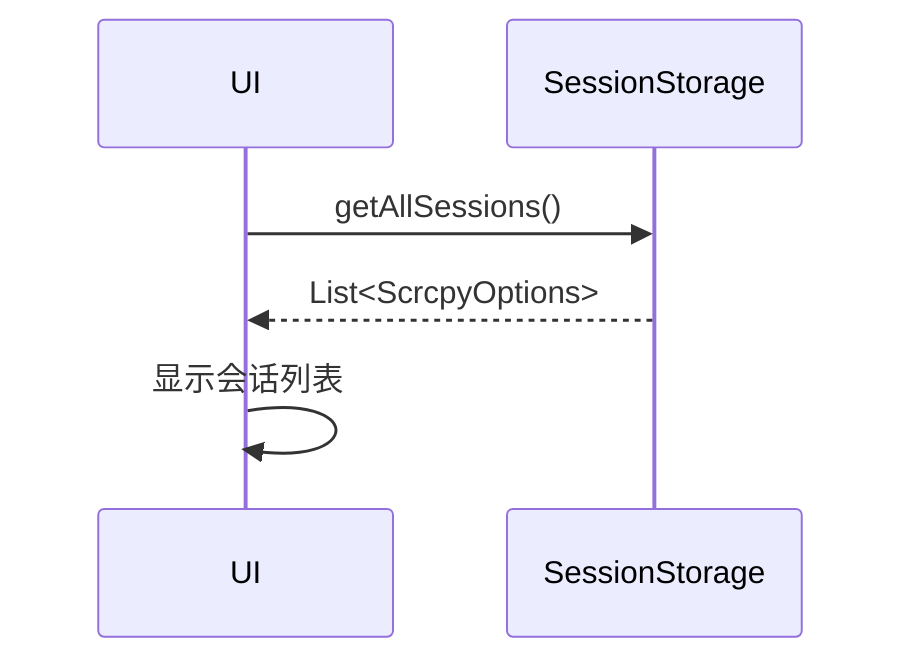
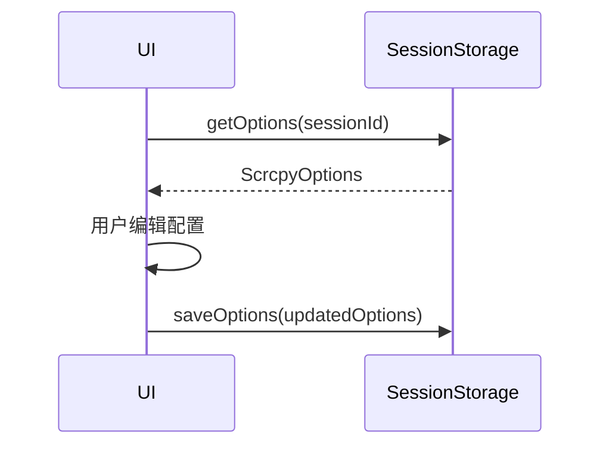
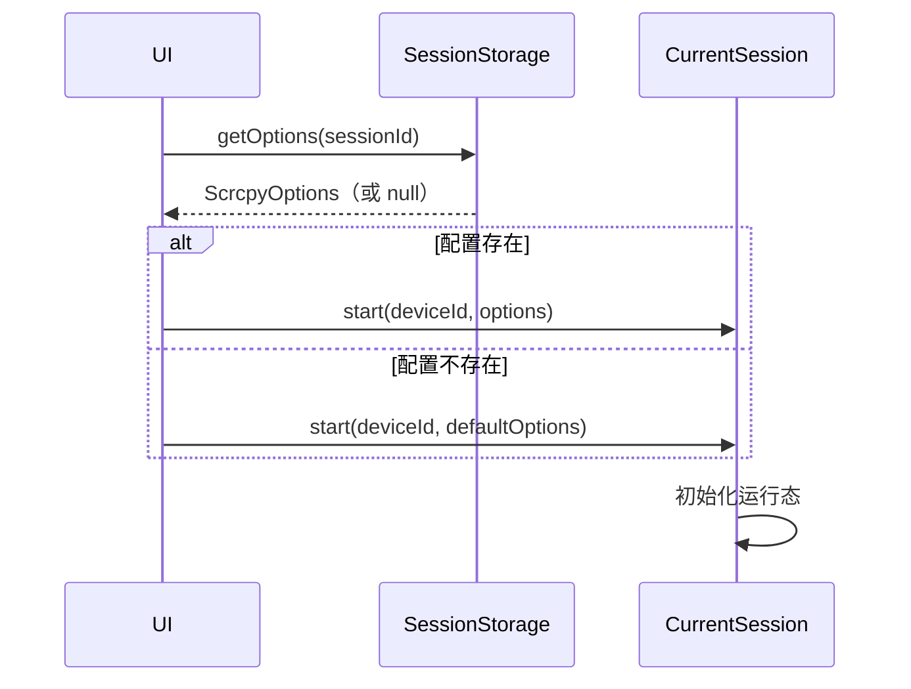
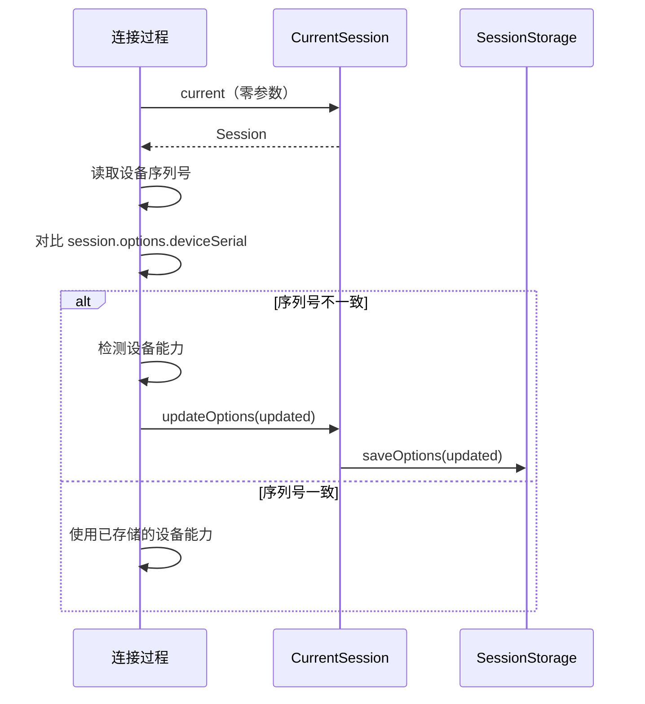
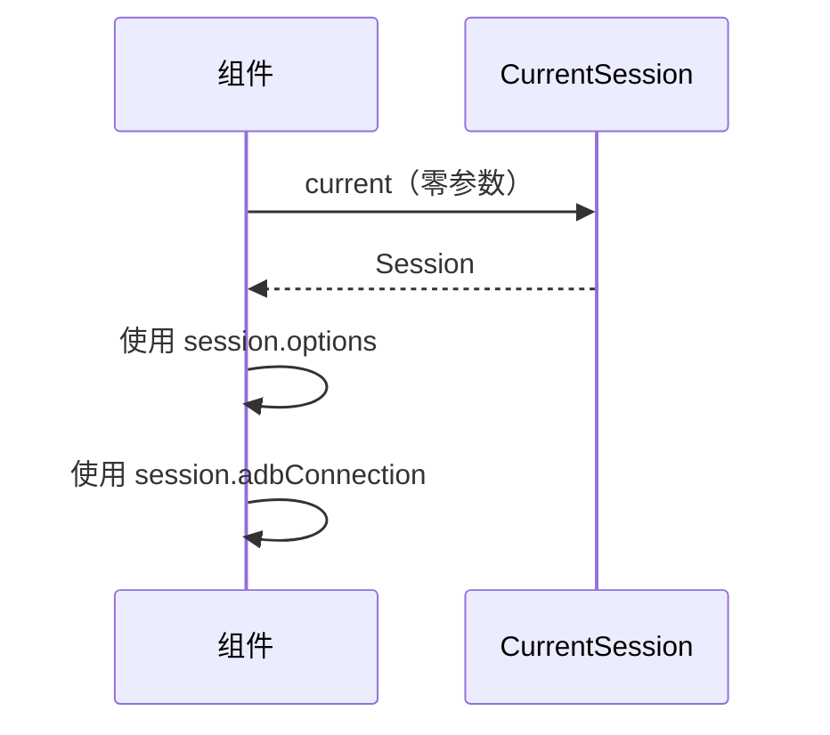
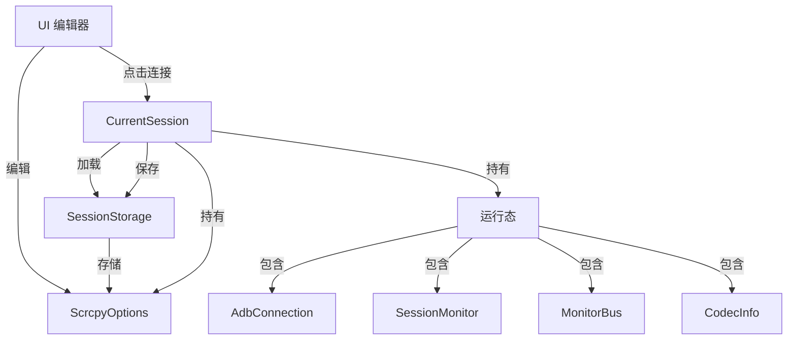
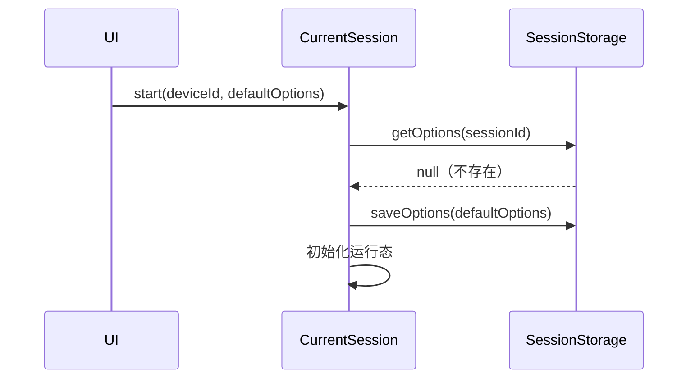
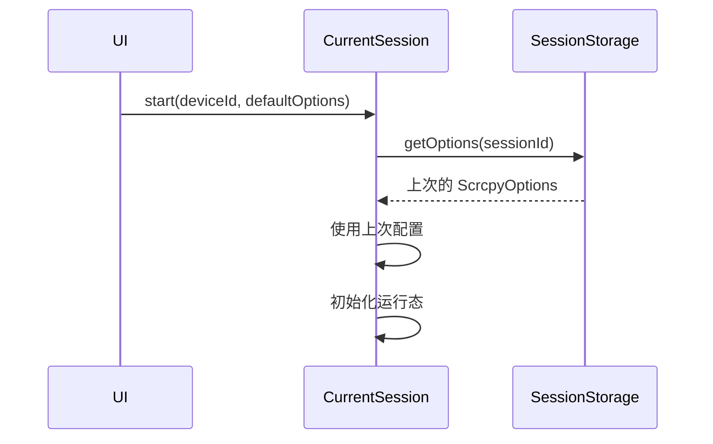
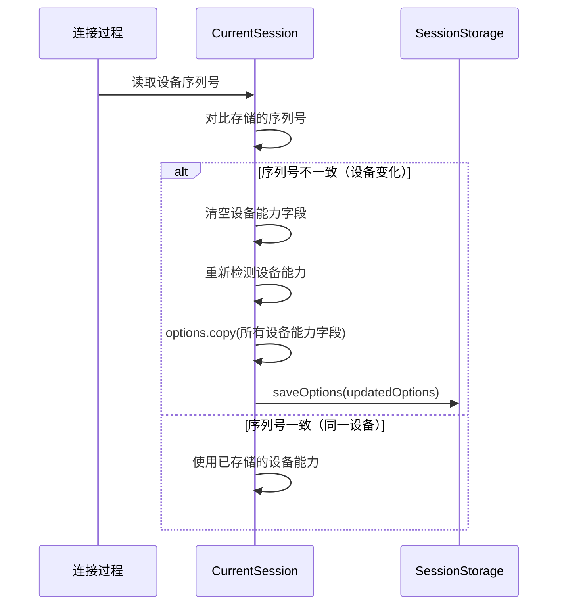
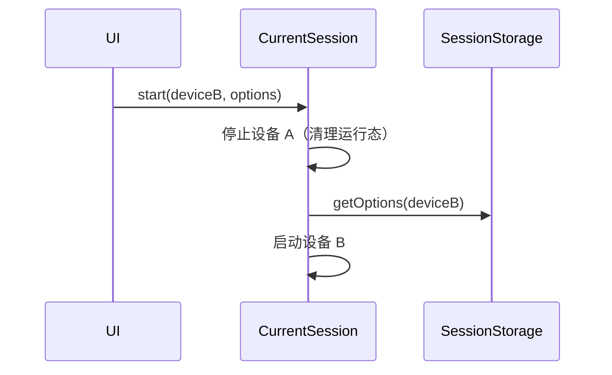

# Scrcpy Mobile 会话管理设计

## 1. 设计目标

✅ **多会话（多设备）** - 支持同时管理多个设备的配置  
✅ **完整配置** - 每个会话有完整的 ScrcpyOptions 结构体  
✅ **按字段更新** - 支持更新任意字段（copy 机制）  
✅ **会话隔离** - 当前会话只看到自己的配置和运行态  
✅ **点击连接初始化** - 连接时加载配置并初始化运行态  
✅ **断开彻底清理** - 运行态清理，配置保留  
✅ **绝不串会话** - 严格隔离，自动切换

---

## 2. 核心概念

### ScrcpyOptions（配置结构体）

**唯一配置载体**，包含两类字段：

**字段分类**

**用户配置字段**
* maxSize、videoBitRate、videoCodec、selectedVideoDecoder 等
* 有明确默认值
* 由 UI 负责更新

**设备能力字段**
* deviceSerial、remoteVideoEncoders、remoteAudioEncoders 等
* 默认空值
* 由连接过程检测并填充
* 设备序列号变化时重新检测

**特性**
* data class，通过 copy() 更新任意字段
* sessionId 作为唯一标识
* deviceSerial 作为设备身份标识
* 所有字段都可更新，由不同模块负责

---

### SessionStorage（配置存储）

**职责**：持久化存储所有设备的 ScrcpyOptions

**核心方法**
```
getOptions(sessionId) → ScrcpyOptions?
saveOptions(options)
deleteOptions(sessionId)
getAllSessions() → List<ScrcpyOptions>
```

**存储时机**
* 首次创建：使用默认值
* UI 编辑：用户修改字段后保存
* 连接过程：检测到设备能力后保存
* 会话结束：配置保留，运行态清理

---

### CurrentSession（当前会话）

**职责**：管理当前活跃会话

**核心属性**
```
options: ScrcpyOptions          // 当前配置
adbConnection: AdbConnection?   // ADB 连接
monitor: SessionMonitor?        // 会话监控
monitorBus: MonitorBus?         // 监控总线
codecInfo: CodecInfo?           // 编解码器检测结果
```

**核心方法**
```
start(deviceId, options)  // 启动会话
stop()                    // 停止会话
current                   // 访问当前会话
```

**特性**
* 同时只有一个活跃会话
* 零参数访问（CurrentSession.current）
* 启动新会话自动停止旧会话

---

## 3. 使用场景说明

### 场景1：会话列表页面

**说明**：加载所有会话配置，展示给用户

---

### 场景2：编辑会话页面

**说明**：需要传 sessionId 加载特定会话的配置

---

### 场景3：点击连接

**说明**：需要传 sessionId 加载配置，然后启动会话

---

### 场景4：连接过程中（零参数访问）

**说明**：连接建立后，无需传参，直接访问 CurrentSession.current

---

### 场景5：运行时组件访问（零参数访问）

**说明**：任何组件都可以零参数访问当前会话

---

## 4. 架构设计



---

## 5. 数据流向

### 首次连接（配置不存在）


### 再次连接（配置存在）


### 连接过程更新


### 会话切换


---

## 5. 配置更新策略

### UI 更新
```
用户修改 → options.copy(字段) → SessionStorage.saveOptions()
```

### 连接过程更新
```
读取设备序列号 → 对比存储的序列号
├─ 不一致：清空设备能力 → 重新检测 → options.copy(字段) → saveOptions()
└─ 一致：使用已存储的设备能力
```

### 更新原则
* 所有字段都可通过 copy() 更新
* 设备序列号作为设备身份标识
* 设备变化时重新检测所有设备能力
* 更新后立即保存到 SessionStorage

---

## 6. 会话隔离保证

**配置隔离**
* SessionStorage 按 sessionId 区分
* 每个设备独立存储
* 设备序列号变化时自动更新设备能力

**运行态隔离**
* CurrentSession 持有独立运行态
* 启动新会话自动清理旧运行态

**访问隔离**
* CurrentSession.current 始终指向当前会话
* 组件访问时自动获取正确配置

---

## 7. 扩展指南

### 添加用户配置字段
```kotlin
data class ScrcpyOptions(
    val sessionId: String,
    val maxSize: Int = 1920,
    val newUserField: Int = 100,  // 新字段，有默认值，由 UI 更新
)
```

### 添加设备能力字段
```kotlin
data class ScrcpyOptions(
    val sessionId: String,
    // ... 其他字段
    val deviceSerial: String = "",
    val newDeviceField: List<String> = emptyList(),  // 新字段，默认空，由连接过程更新
)
```

### 更新字段
```kotlin
// 任何模块都可以更新任意字段
val updated = options.copy(anyField = newValue)
SessionStorage.saveOptions(updated)
```

---

## 8. 设计原则

> **ScrcpyOptions** - 唯一配置载体（结构体）  
> **SessionStorage** - 配置持久化（存储所有设备）  
> **CurrentSession** - 当前会话管理（配置 + 运行态）

**核心理念**
* 配置与运行态分离
* 多会话支持，当前会话机制
* 零参数访问，自动切换
* 严格隔离，彻底清理
